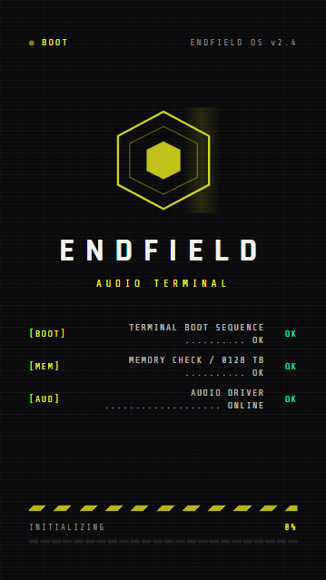
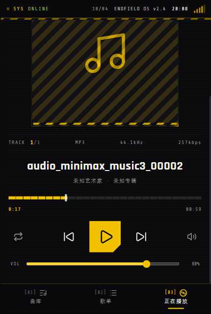
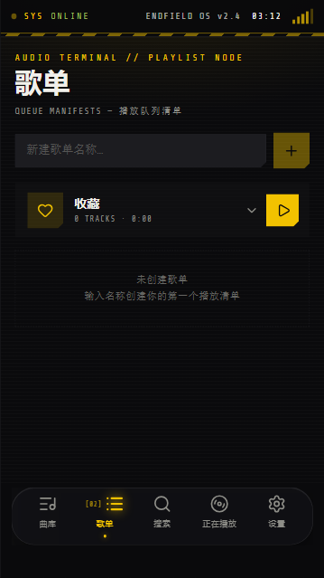
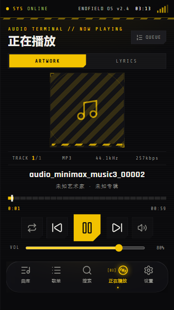
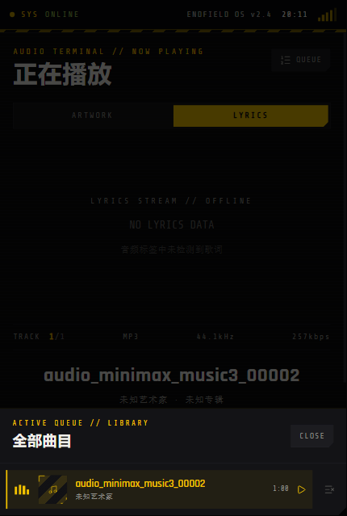
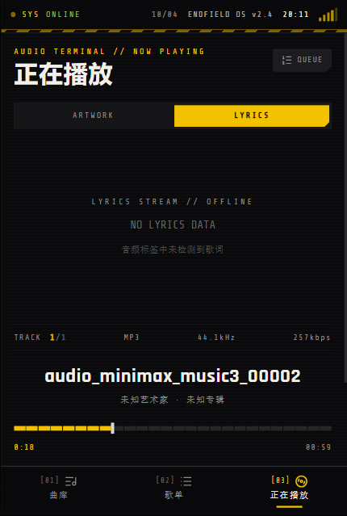

# 终末地音乐终端 · Endfield Music Terminal

一款以《明日方舟：终末地》为视觉灵感、可打包为 Android APK 的**本地音乐播放器**。整体采用黄 / 黑 / 暖白三色，密集使用终末地风格的系统 UI 元素（警戒条纹、角括号面板、切角按钮、六边形徽章、BOOT 日志式启动动画）。


[](https://github.com/TATHPE/endfield-music-terminal/releases)
[](https://github.com/TATHPE/endfield-music-terminal/releases)
[](LICENSE)
[](https://github.com/TATHPE/endfield-music-terminal)
[](https://github.com/TATHPE/endfield-music-terminal)
[](https://github.com/TATHPE/endfield-music-terminal/actions)
[](https://github.com/TATHPE/endfield-music-terminal)

## 功能特性

- **本地歌曲导入**：从设备文件系统批量导入音频，曲库持久化存储在浏览器 IndexedDB
- **专辑封面解析**：用 `music-metadata` 解析 ID3 / FLAC / MP4 / OGG / WAV / APE 等标签与内嵌封面；无内嵌封面时以 iTunes Search 兜底搜索
- **三 Tab 界面 + 手势滑动切换**：曲库 / 歌单 / 正在播放，支持底部导航点击或左右滑动切换
- **正在播放面板**：ARTWORK（封面 + 播放扫描动画）/ LYRICS 双面板，分段刻度进度条、循环 / 随机 / 单曲三种播放模式
- **播放队列**：底部上滑队列面板，可查看队列、移除曲目；支持收藏与自定义歌单（IndexedDB 持久化）
- **同步歌词**：内置 LRC 解析器（时间戳 / offset 标签），播放时逐行高亮并自动滚动居中
- **后台播放与锁屏控制**：基于 Media Session 的 Android 前台媒体服务，锁屏 / 通知栏显示歌曲、封面、进度并可控制（播放 / 暂停 / 上下曲 / ±10s 快进快退 / 拖动进度）
- **终末地风格启动动画**：六边形徽章脉冲 + 扫描光带 + 逐行 BOOT 日志 + 24 段进度条，约 2.6 秒，可点击跳过
- **终末地风格应用图标**：自绘黄黑六边形徽章 + 双八分音符 + 频谱条 + 警戒条纹，全套 Android 自适应图标
- **Android / ColorOS 17 适配**：沉浸式状态栏与导航栏、安全区预留（`pt-safe` / `pb-safe`）、深色主题、通知权限运行时请求
- **离线可用**：Web 端与 APK 均不依赖云端服务

## 界面预览

> 截图取自 Android 同构的 Web 预览（430px 手机布局），与实际 APK 界面一致。

| | |
| --- | --- |
| **① 启动动画** —— 六边形徽章脉冲、BOOT 逐行自检日志、24 段进度条，点击可跳过。<br><br> | **② 曲库** —— 本地曲库列表与曲目信息，右上角「导入曲目」批量导入音频。<br><br> |
| **③ 歌单** —— 收藏清单与自定义歌单，支持新建、展开、播放、移除。<br><br> | **④ 正在播放（ARTWORK）** —— 封面 / 格式参数 / 分段进度条 / 传输控制；播放时封面带扫描线与旋转工程环。<br><br> |
| **⑤ 播放队列** —— 从正在播放页右上角 QUEUE 上滑呼出，查看与移除队列曲目。<br><br> | **⑥ 歌词面板（LYRICS）** —— ARTWORK / LYRICS 切换，LRC 歌词逐行高亮同步滚动；无歌词时提示。<br><br> |

## 使用方式

1. **导入歌曲**：进入「曲库」页，点击右上角 **+ 导入曲目**，选择音频文件（mp3 / flac / wav / m4a / ogg / ape 等）。导入后曲库显示曲目、艺术家、专辑与时长；歌曲无内嵌封面时会自动向 iTunes 搜索兜底。
2. **开始播放**：点击曲库中的曲目即开始播放并进入「正在播放」页。底部 **MiniPlayer** 常驻显示当前播放进度，点击可回到正在播放页。
3. **正在播放页**：
   - **ARTWORK / LYRICS**：切换封面视图与同步歌词视图；歌词随播放逐行高亮、自动滚动居中。
   - **QUEUE**：打开底部队列面板，查看全部队列曲目，可移除任意曲目。
   - **播放模式**：点击循环图标在「顺序 → 随机 → 单曲循环」之间切换，图标带切换动画。
   - **进度与音量**：分段刻度进度条可拖动跳转；VOL 滑块调节音量。
4. **收藏与歌单**：曲库行内可点 **收藏**（加入「收藏」清单）或 **加入歌单**（可即时新建）；「歌单」Tab 内管理清单。
5. **滑动切换界面**：在主体区域**左右滑动**即可在 曲库 ↔ 歌单 ↔ 正在播放 ↔ 设置 之间切换（底部导航点击同样可用）。
6. **主题设置**：「设置」Tab 内可在 **标准终端**（柠檬黄/黑/暖白，默认）与 **棱镜频谱**（亮粉/青绿/明黄）之间切换；主题即时生效并覆盖全部界面——含启动动画、警戒条纹、歌词高亮、滚动条与进度控件，选择后持久化保存。
7. **后台播放与锁屏控制（Android）**：播放中退到后台/锁屏后，通知栏与锁屏界面显示歌曲、封面与进度；支持播放 / 暂停 / 上一曲 / 下一曲 / ±10 秒快进快退 / 拖动进度。修复了锁屏/系统媒体控件调节无效的问题（媒体按键与传输控制标志、seek 回调字段对齐）。首次安装 Android 13+ 会请求通知权限。
8. **重启恢复**：曲库、歌单、播放模式、音量与主题偏好持久化保存，重新打开应用自动恢复。

## 下载

| 版本 | 说明 | 下载 |
| --- | --- | --- |
| v1.1.0 (release) | 正式签名版，适用于日常安装；**新增棱镜频谱主题（粉/青/黄三色）+ 主题设置**；**修复锁屏/系统媒体控件调节无效** | [EndfieldMusicTerminal-v1.0.apk](https://github.com/TATHPE/endfield-music-terminal/releases/download/v1.0.0/EndfieldMusicTerminal-v1.0.apk) |
| v1.1.0 (debug) | 调试签名版，仅用于体验；**新增棱镜频谱主题 + 主题设置**；**修复锁屏/系统媒体控件调节无效** | [EndfieldMusicTerminal-v1.0-debug.apk](https://github.com/TATHPE/endfield-music-terminal/releases/download/v1.0.0/EndfieldMusicTerminal-v1.0-debug.apk) |

> ColorOS 17 侧载时若提示「未知来源」，在设置中允许安装即可。

## 技术栈


| 层 | 技术 |
| --- | --- |
| Web 前端 | React 19 + TypeScript + Tailwind CSS v4 |
| 播放引擎 | HTML5 Audio + Web Audio API（频谱动画） |
| 标签解析 | music-metadata（浏览器 WASM 构建） |
| 数据存储 | IndexedDB（曲库） / localStorage（偏好） |
| 移动端封装 | Capacitor 8（Android 平台） |
| 构建 | Vite（Web）+ Gradle 8.14 / AGP 8.13（APK） |

## 目录结构

```
endfield-player/
├── src/                    # Web 源码
│   ├── pages/HomePage/     # 主页面（曲库 / 歌单 / 正在播放 + 滑动切换）
│   ├── components/player/  # 播放器组件（SplashScreen / BottomNav / NowPlayingView / QueuePanel ...）
│   └── lib/                # 数据层（db.ts / parser.ts / lyrics.ts / playlists.ts / player-context.ts）
├── android/                # Capacitor Android 原生工程（含自绘应用图标）
├── public/
├── capacitor.config.ts     # Capacitor 配置（appId: com.endfield.audio.terminal）
├── vite.config.ts          # Web 构建配置
└── vite.capacitor.config.ts# APK 专用构建配置（输出 dist/apk）
```

## 本地运行（Web）

```bash
npm install
npm run dev
```

## 构建 Android APK

需要 JDK 17+（推荐 21）、Android SDK（platform 36 / build-tools 36）、Gradle 8.14+。

```bash
# 1. 构建 Web 产物（专用配置，产出 dist/apk）
npx vite build --config vite.capacitor.config.ts

# 2. 同步到 Android 工程
npx cap sync android

# 3. 构建 debug APK（产物在 android/app/build/outputs/apk/debug/）
cd android
gradle assembleDebug
```

### GitHub Actions 自动构建

每次 push 到 `main` 会自动构建 debug APK，产物上传为 Actions Artifact（仓库 Actions 页面可下载最新版）。

如需自动构建**正式签名版**，在仓库 Settings → Secrets and variables → Actions 新增：

| Secret | 值 |
| --- | --- |
| `KEYSTORE_BASE64` | 密钥库文件 base64 编码（`base64 -w0 release.keystore` 或 `certutil -encode` 输出） |
| `KEYSTORE_PASSWORD` | 密钥库密码（storePassword = keyPassword） |
| `KEYSTORE_ALIAS` | 密钥别名（本项目为 `endfield`） |

配置后，每次 push 的 `release` job 会自动用该密钥构建并上传正式签名 APK。

## 应用信息

- 应用名：终末地音乐终端
- 包名 / applicationId：`com.endfield.audio.terminal`
- minSdk 24 / targetSdk 36
- Android 版本：v1.1.0（versionCode 3，主题设置 + 锁屏调节修复）

## License

本项目以 [MIT License](LICENSE) 开源，可自由使用、修改与分发（含商用），须保留版权声明。

## 免责声明

本项目为粉丝向学习项目，与《明日方舟：终末地》及其开发商无关，不包含任何游戏素材与版权资源。
