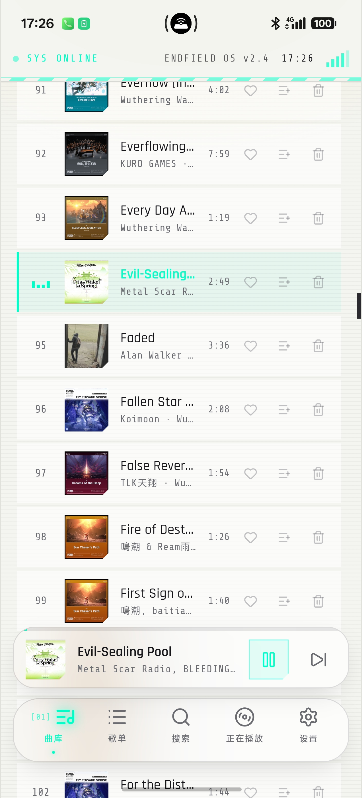
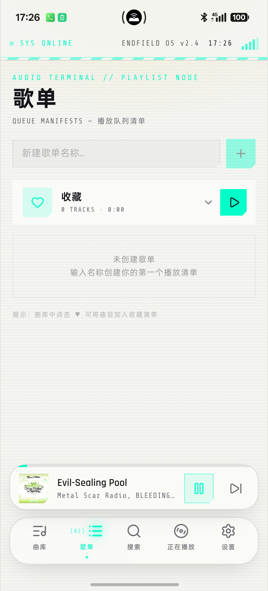
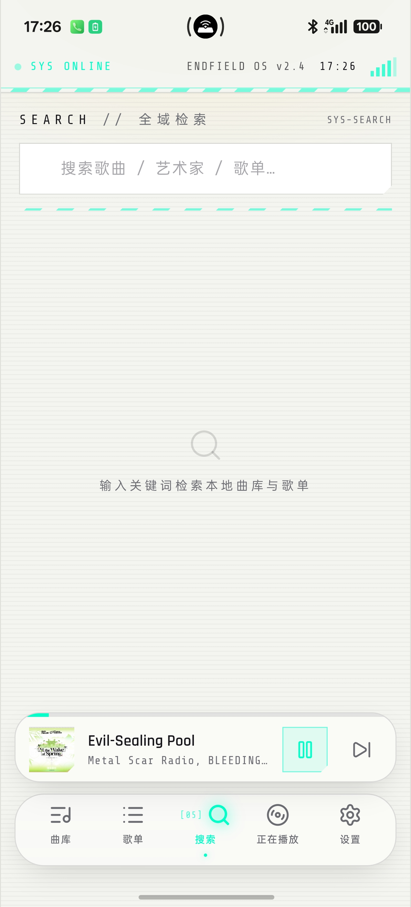
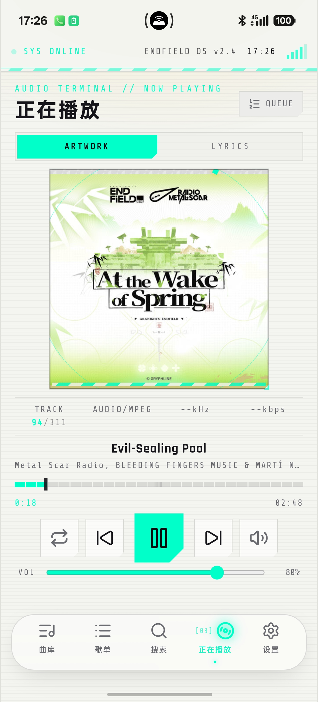
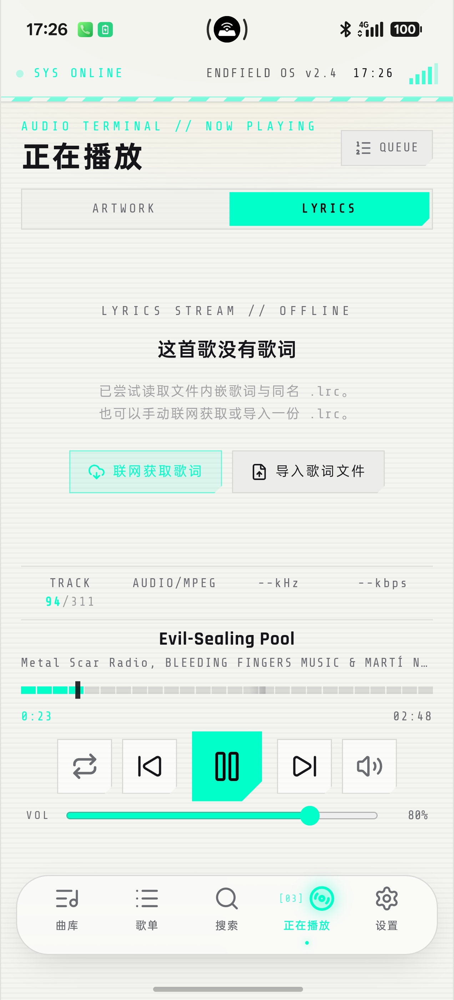
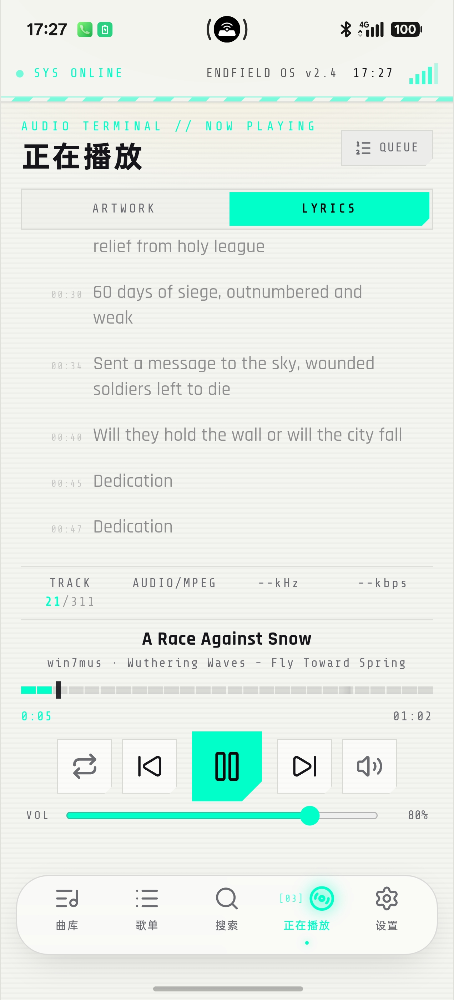
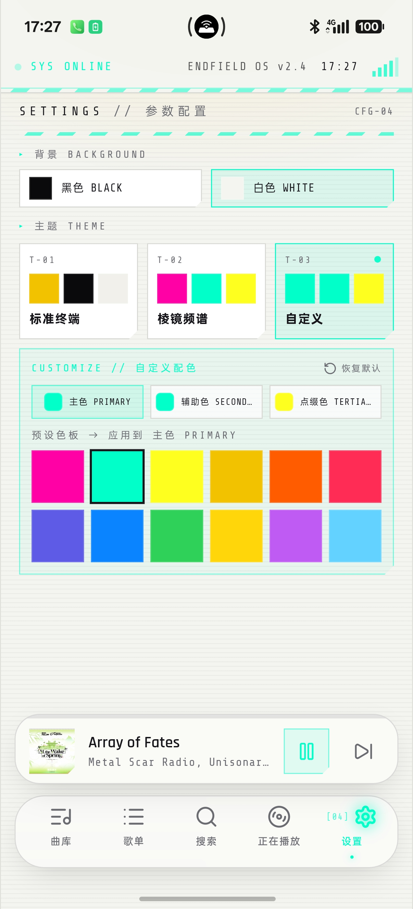

# 终末地音乐终端 · Endfield Music Terminal

一款以《明日方舟：终末地》为视觉灵感、可打包为 Android APK 的**本地音乐播放器**。整体采用黄 / 黑 / 暖白三色，密集使用终末地风格的系统 UI 元素（警戒条纹、角括号面板、切角按钮、六边形徽章、BOOT 日志式启动动画）。


[](https://github.com/TATHPE/endfield-music-terminal/releases)
[](https://github.com/TATHPE/endfield-music-terminal/releases)
[](LICENSE)
[](https://github.com/TATHPE/endfield-music-terminal)
[](https://github.com/TATHPE/endfield-music-terminal)
[](https://github.com/TATHPE/endfield-music-terminal/actions)
[](https://github.com/TATHPE/endfield-music-terminal)

## 功能特性

- **本地歌曲导入**：从设备文件系统批量导入音频，曲库持久化存储在浏览器 IndexedDB
- **内置预置曲库**：14 首《明日方舟：终末地》官方 Vocal 曲目随 APK 打包（完整版），打开曲库即可直接播放，每首带专辑封面与 LRC 歌词；轻量「无歌曲版」仅保留导入功能
- **专辑封面解析**：用 `music-metadata` 解析 ID3 / FLAC / MP4 / OGG / WAV / APE 等标签与内嵌封面；无内嵌封面时以 iTunes Search 后台线程池异步兜底匹配（不阻塞扫描与播放）
- **五视图界面 + 手势滑动切换**：曲库 / 歌单 / 搜索 / 正在播放 / 设置，支持底部 Dock 点击或左右滑动切换
- **正在播放面板**：ARTWORK（封面 + 播放扫描动画）/ LYRICS 双面板，分段刻度进度条、循环 / 随机 / 单曲三种播放模式
- **播放队列**：底部上滑队列面板，可查看队列、移除曲目；支持收藏与自定义歌单（IndexedDB 持久化）
- **同步歌词**：内置 LRC 解析器（时间戳 / offset 标签），播放时逐行高亮并自动滚动居中；设备扫描仅读取本地同名 .lrc/.txt，无歌词歌曲可在歌词页自主选择「联网获取歌词」或「导入歌词文件」（.lrc）
- **后台播放与锁屏控制**：基于 Media Session 的 Android 前台媒体服务，锁屏 / 通知栏显示歌曲、封面、进度并可控制（播放 / 暂停 / 上下曲 / ±10s 快进快退 / 拖动进度）。⚠️ 已知遗留问题：ColorOS 17 锁屏界面拖动进度条仍会回弹、无法随进度条快进（Media Session 兼容限制，后续版本继续跟进）
- **终末地风格启动动画**：六边形徽章脉冲 + 扫描光带 + 逐行 BOOT 日志 + 24 段进度条，约 2.6 秒，可点击跳过
- **终末地风格应用图标**：黑胶唱片式图标——纯白四角 + 黑色唱片盘面 + 黄色六边形播放键与外圈环形进度条（黄 / 黑 / 白三色统一），全密度位图嵌入 Android Launcher
- **主流安卓系统适配（Android 8–16）**：状态栏 / 导航栏图标深浅与明暗背景自动联动（Android 15/16 强制 edge-to-edge 下的 `appearance` API 与 Android 14- 的着色双轨兼容，适配 ColorOS / HyperOS / OriginOS / 鸿蒙 / One UI 等主流系统）、预测性返回手势、横屏刘海 / 挖孔安全区、通知权限运行时请求
- **离线可用**：Web 端与 APK 均不依赖云端服务

## 界面预览

> 截图取自 ColorOS 17 真机实拍（竖屏），与实际 APK 界面一致。

**浅色主题界面（v1.4.1 真机实拍）**——白色纯色背景、自定义主题（T-03）与预设色板、无歌词引导界面均正常显示：

| | |
| --- | --- |
| **① 曲库 · 浅色主题** —— 白色纯色背景下的曲库列表（播放中曲目高亮、MiniPlayer 悬浮胶囊、毛玻璃 Dock 常驻），浅色模式下文字与控件正常显示。<br><br> | **② 歌单 · 浅色主题** —— 播放队列清单页在浅色背景下的显示（收藏清单、新建歌单入口）。<br><br> |
| **③ 搜索 · 浅色主题** —— 全域检索页（搜索歌曲 / 艺术家 / 歌单）。<br><br> | **④ 正在播放 · 封面 · 浅色** —— ARTWORK 面板在浅色主题下的专辑封面完整正方形显示。<br><br> |
| **⑤ 正在播放 · 无歌词引导** —— 歌曲无歌词时显示「这首歌没有歌词」引导界面，提供「联网获取歌词」与「导入歌词文件」两个操作（v1.4.1 新增）。<br><br> | **⑥ 正在播放 · 歌词 · 浅色** —— LRC 歌词逐行高亮在浅色背景下的阅读效果。<br><br> |
| **⑦ 设置 · 浅色主题** —— 白色背景 + T-03 自定义主题选中，自定义配色与预设色板完整显示、不被 Dock 遮挡。<br><br> | |

## 使用方式

1. **导入歌曲**：进入「曲库」页，点击右上角 **+ 导入曲目**，选择音频文件（mp3 / flac / wav / m4a / ogg / ape 等）。导入后曲库显示曲目、艺术家、专辑与时长；歌曲无内嵌封面时会自动向 iTunes 搜索兜底（后台异步匹配，不阻塞操作）。
2. **开始播放**：点击曲库中的曲目即开始播放并进入「正在播放」页。底部 **MiniPlayer** 常驻显示当前播放进度，点击可回到正在播放页。
3. **正在播放页**：
   - **ARTWORK / LYRICS**：切换封面视图与同步歌词视图；歌词随播放逐行高亮、自动滚动居中；无歌词时显示引导界面，可点击「联网获取歌词」或「导入歌词文件」。
   - **QUEUE**：打开底部队列面板，查看全部队列曲目，可移除任意曲目。
   - **播放模式**：点击循环图标在「顺序 → 随机 → 单曲循环」之间切换，图标带切换动画。
   - **进度与音量**：分段刻度进度条可拖动跳转；VOL 滑块调节音量。
4. **收藏与歌单**：曲库行内可点 **收藏**（加入「收藏」清单）或 **加入歌单**（可即时新建）；「歌单」Tab 内管理清单。
5. **滑动切换界面**：在主体区域**左右滑动**即可在 曲库 ↔ 歌单 ↔ 搜索 ↔ 正在播放 ↔ 设置 之间切换（底部导航点击同样可用）；滑入搜索页时**不会自动弹出键盘**，点击搜索框才唤起。
6. **搜索**：底部 Dock 中央的搜索按钮进入全域检索，按关键词过滤本地曲库（歌曲 / 艺术家 / 专辑）与歌单，结果可直接播放或加入队列。
7. **主题设置**：「设置」Tab 内可在 **标准终端**（柠檬黄/黑/暖白，默认）、**棱镜频谱**（亮粉/青绿/明黄）与 **自定义** 之间切换；自定义主题通过自绘 HSV 调色器（饱和度/亮度板 + 色相条 + HEX 直输）与 12 预设色板自由调配主色、辅助色、点缀色，实时生效并持久化保存；主题覆盖全部界面——含启动动画、警戒条纹、歌词高亮、滚动条、进度控件与底部 Dock。
8. **纯色背景切换**：设置页可切换 **黑色 / 白色** 纯色外壳；浅色模式下前景、卡片、网格、玻璃 Dock 与播放条自动适配明暗。
9. **底部 Dock（ColorOS 17 规范）**：毛玻璃胶囊（图标 + 文字说明），中央搜索按钮；Dock 位于系统手势条（安全区）之上且为**底部固定层**——内容滚动区域自动收缩在 Dock 上方，任何控件都不会被 Dock 遮挡或拦截点击；播放中的 **MiniPlayer 为毛玻璃悬浮胶囊**，位于 Dock 上方。
10. **后台播放与锁屏控制（Android）**：播放中退到后台/锁屏后，通知栏与锁屏界面显示歌曲、封面与进度；支持播放 / 暂停 / 上一曲 / 下一曲 / ±10 秒快进快退 / 拖动进度。修复了锁屏/系统媒体控件调节无效的问题（媒体按键与传输控制标志、seek 回调字段对齐）。⚠️ 已知遗留问题：ColorOS 17 锁屏界面拖动进度条仍会回弹、无法快进，属 Media Session 在该 ROM 的兼容限制，尚未完全解决。首次安装 Android 13+ 会请求通知权限。
11. **重启恢复**：曲库、歌单、播放模式、音量、主题与背景偏好持久化保存，重新打开应用自动恢复。

## 下载

| 版本 | 说明 | 下载 |
| --- | --- | --- |
| v1.4.1 (release · 正式版) | 正式签名版，**歌词获取流程重构**：扫描歌曲仅读取本地同名 .lrc/.txt、**不自动联网匹配**；无歌词歌曲在歌词页自主选择「联网获取歌词」或「导入歌词文件」；封面在线匹配改为后台线程池异步执行；修复曲库副标题 ORIGIN NODE — 本地音频存储 在安卓上的错误断行；不含预置歌曲（通过扫描设备从手机导入） | [EndfieldMusicTerminal-v1.4.1.apk](https://github.com/TATHPE/endfield-music-terminal/releases/download/v1.4.1/EndfieldMusicTerminal-v1.4.1.apk) |
| v1.4.0 (release · 正式版) | 正式签名版，**设备音乐自动化**：一键「扫描设备」导入手机音乐（自动去重）；歌词自动匹配（本地 LRC 优先 → 网易云 / QQ 音乐双源联网匹配）；无内嵌封面自动联网匹配专辑封面（iTunes 公共曲库）；设备歌曲改为原生读取 + Blob 播放（根治 ColorOS 17 WebView 音频不可拖动 / 无声）；不含预置歌曲（通过扫描设备从手机导入） | [EndfieldMusicTerminal-v1.4.0.apk](https://github.com/TATHPE/endfield-music-terminal/releases/download/v1.4.0/EndfieldMusicTerminal-v1.4.0.apk) |
| v1.3.9 (release · 完整版) | 正式签名版，**内置 14 首《明日方舟：终末地》预置曲库**（含封面与 LRC 歌词，打开曲库即可播放）；**应用图标重绘为黑胶唱片式**（纯白四角 + 黑色盘面 + 黄色六边形播放键与环形进度条，黄/黑/白三色统一），全密度位图嵌入 Launcher（48–192px） | [EndfieldMusicTerminal-v1.3.9.apk](https://github.com/TATHPE/endfield-music-terminal/releases/download/v1.0.0/EndfieldMusicTerminal-v1.3.9.apk) |
| v1.3.9 (release · 无歌曲版) | 正式签名版，**不含预置曲库**（约 4 MB 轻量包），仅保留导入与全部功能 | [EndfieldMusicTerminal-v1.3.9-lite.apk](https://github.com/TATHPE/endfield-music-terminal/releases/download/v1.0.0/EndfieldMusicTerminal-v1.3.9-lite.apk) |
| v1.3.9 (debug) | 调试签名版（完整版），仅用于体验 | [EndfieldMusicTerminal-v1.3.9-debug.apk](https://github.com/TATHPE/endfield-music-terminal/releases/download/v1.0.0/EndfieldMusicTerminal-v1.3.9-debug.apk) |
| v1.3.8 (release · 完整版) | 正式签名版，**内置 14 首《明日方舟：终末地》预置曲库**（含封面与 LRC 歌词，打开曲库即可播放）；**全版本强制 edge-to-edge 根治浅色状态栏黑条**（状态栏/导航栏区域改由应用内容直接绘制，明暗完全跟随主题，任何 ROM 都无法再覆盖成黑条）；修复原生兜底时序（页面加载完成才读背景模式，避免误判）+ 布局单位兼容（旧内核下 Dock 位置正确） | [EndfieldMusicTerminal-v1.3.8.apk](https://github.com/TATHPE/endfield-music-terminal/releases/download/v1.0.0/EndfieldMusicTerminal-v1.3.8.apk) |
| v1.3.8 (release · 无歌曲版) | 正式签名版，**不含预置曲库**（约 4 MB 轻量包），仅保留导入与全部功能 | [EndfieldMusicTerminal-v1.3.8-lite.apk](https://github.com/TATHPE/endfield-music-terminal/releases/download/v1.0.0/EndfieldMusicTerminal-v1.3.8-lite.apk) |
| v1.3.8 (debug) | 调试签名版（完整版），仅用于体验 | [EndfieldMusicTerminal-v1.3.8-debug.apk](https://github.com/TATHPE/endfield-music-terminal/releases/download/v1.0.0/EndfieldMusicTerminal-v1.3.8-debug.apk) |

> **v1.4.1 更新内容（歌词获取流程重构）**：设备扫描歌曲后仅读取本地同名 .lrc / .txt 歌词，**不再自动联网匹配**——无歌词歌曲在歌词页显示「这首歌没有歌词」引导界面，由用户自主选择「联网获取歌词」（网易云 / QQ 音乐双源）或「导入歌词文件」（本地 .lrc）；封面在线匹配（iTunes 公共曲库）改为后台线程池异步执行，扫描与播放不再被网络 I/O 阻塞；修复曲库副标题 `ORIGIN NODE — 本地音频存储` 在安卓上的错误断行（词组级换行，不再从词中断开）。**终末地歌曲资产**：正式版不含预置歌曲，《明日方舟：终末地》官方 Vocal 曲目（14 首，含专辑封面与 LRC 歌词）可下载歌曲资产包 **EndfieldSongs-v1.0.zip**（位于 v1.0.0 Release 资产，约 92 MB）：https://github.com/TATHPE/endfield-music-terminal/releases/download/v1.0.0/EndfieldSongs-v1.0.zip —— 解压后通过「+ 导入曲目」批量导入即可。
> **v1.4.0 更新内容（设备音乐自动化 · 正式版）**：新增「扫描设备」一键导入手机音乐（自动去重）；歌词自动匹配（本地 LRC 优先 → 网易云 / QQ 音乐双源联网匹配并写入曲库）；无内嵌封面自动匹配专辑封面（Apple iTunes 公共曲库，歌名 + 歌手匹配，300×300 大图）；设备歌曲播放重构为原生读取 + Blob 播放（根治 ColorOS 17 上 WebView 音频不可拖动、播放无声）；权限被拒时弹窗一键跳转系统权限页；锁屏进度条新增防回弹机制（对系统媒体控件时间回灌生效）。⚠️ **已知遗留问题**：ColorOS 17 锁屏界面拖动进度条仍会回弹、无法随进度条快进（Media Session 兼容限制），后续版本继续跟进；扫描导入大量歌曲时匹配歌词/封面属同步网络 I/O，期间播放指令会短暂排队（详见 Release 说明），属正常现象。
> **v1.3.9 更新内容（应用图标重绘 · 黑胶唱片式）**：将应用图标整体重绘为黑胶唱片式视觉——纯白四角背景（干净无装饰）+ 黑色唱片盘面 + 中央黄色六边形播放键与外圈黄色环形进度条（黄/黑/白三色与界面风格统一）；同时将图标由原自适应矢量改为**全密度位图嵌入**（mdpi 48 至 xxxhdpi 192，圆角方形 Launcher 图标），各机型显示一致、无系统遮罩偏差。功能与适配保持 v1.3.8 全部能力（全版本 edge-to-edge、ColorOS 17 / OriginOS 3 / HyperOS 等主流系统适配、14 首预置曲库、LRC 歌词、三主题自定义、锁屏控制）。
> **v1.3.8 更新内容（浅色状态栏黑条 · 全版本 edge-to-edge 根治）**：前两版（v1.3.6 仅加触发次数、v1.3.7 插件改名 + 原生兜底）在 OriginOS 3 真机上仍未生效——排查发现其根因不只是插件时序：非强制 edge-to-edge 的 Android（OriginOS 3 / Android 13 等）上，状态栏颜色由系统 `statusBarColor` 决定，任何着色调用都可能被 ROM 拦截或时序错过。v1.3.8 改为**所有 Android 版本强制 edge-to-edge**（`setDecorFitsSystemWindows(false)`），状态栏 / 导航栏区域直接由应用内容绘制，明暗背景**纯 CSS 跟随主题**——浅色模式必为浅色、深色模式必为深色，不再依赖任何原生着色调用；同时修复原生兜底在页面加载完成前误读背景模式的时序问题（`readyState` 门控 + 24 次重试），并将布局单位从 `dvh` 换成兼容写法（修复部分旧内核 Dock 位置异常）。
> ColorOS 17 侧载时若提示「未知来源」，在设置中允许安装即可。

## 技术栈


| 层 | 技术 |
| --- | --- |
| Web 前端 | React 19 + TypeScript + Tailwind CSS v4 |
| 播放引擎 | HTML5 Audio + Web Audio API（频谱动画） |
| 标签解析 | music-metadata（浏览器 WASM 构建） |
| 数据存储 | IndexedDB（曲库） / localStorage（偏好） |
| 移动端封装 | Capacitor 8（Android 平台） |
| 构建 | Vite（Web）+ Gradle 8.14 / AGP 8.13（APK） |

## 目录结构

```
endfield-player/
├── src/                    # Web 源码
│   ├── pages/HomePage/     # 主页面（曲库 / 歌单 / 正在播放 + 滑动切换）
│   ├── components/player/  # 播放器组件（SplashScreen / BottomNav / NowPlayingView / QueuePanel ...）
│   └── lib/                # 数据层（db.ts / parser.ts / lyrics.ts / playlists.ts / player-context.ts）
├── android/                # Capacitor Android 原生工程（含自绘应用图标）
├── public/
├── capacitor.config.ts     # Capacitor 配置（appId: com.endfield.audio.terminal）
├── vite.config.ts          # Web 构建配置
└── vite.capacitor.config.ts# APK 专用构建配置（输出 dist/apk）
```

## 本地运行（Web）

```bash
npm install
npm run dev
```

## 构建 Android APK

需要 JDK 17+（推荐 21）、Android SDK（platform 36 / build-tools 36）、Gradle 8.14+。

```bash
# 1. 构建 Web 产物（专用配置，产出 dist/apk）
npx vite build --config vite.capacitor.config.ts

# 2. 同步到 Android 工程
npx cap sync android

# 3. 构建 debug APK（产物在 android/app/build/outputs/apk/debug/）
cd android
gradle assembleDebug
```

### GitHub Actions 自动构建

每次 push 到 `main` 会自动构建 debug APK，产物上传为 Actions Artifact（仓库 Actions 页面可下载最新版）。

如需自动构建**正式签名版**，在仓库 Settings → Secrets and variables → Actions 新增：

| Secret | 值 |
| --- | --- |
| `KEYSTORE_BASE64` | 密钥库文件 base64 编码（`base64 -w0 release.keystore` 或 `certutil -encode` 输出） |
| `KEYSTORE_PASSWORD` | 密钥库密码（storePassword = keyPassword） |
| `KEYSTORE_ALIAS` | 密钥别名（本项目为 `endfield`） |

配置后，每次 push 的 `release` job 会自动用该密钥构建并上传正式签名 APK。

## 应用信息

- 应用名：终末地音乐终端
- 包名 / applicationId：`com.endfield.audio.terminal`
- minSdk 24 / targetSdk 36
- Android 版本：v1.4.1（versionCode 16；歌词获取流程重构：扫描不自动联网匹配 / 歌词页自主获取或导入 / 封面异步匹配）；历史稳定版 v1.4.0 / v1.3.9 / v1.3.8 保留在对应 Release 可下载

## License

本项目以 [MIT License](LICENSE) 开源，可自由使用、修改与分发（含商用），须保留版权声明。

## 免责声明

本项目为粉丝向学习项目，与《明日方舟：终末地》及其开发商无关，不包含任何游戏素材与版权资源。
