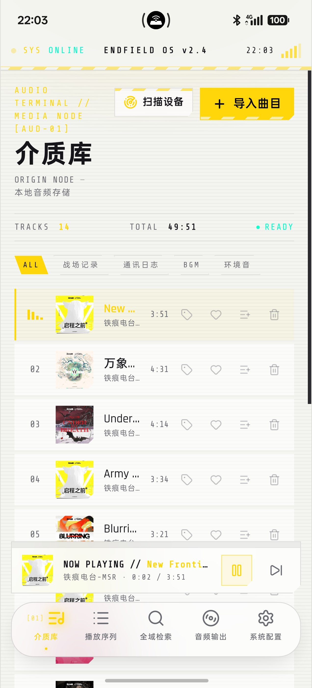
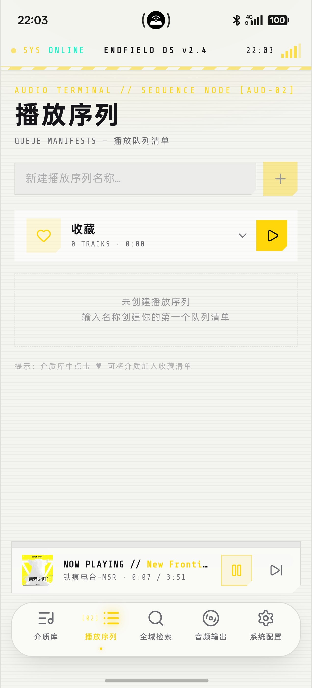
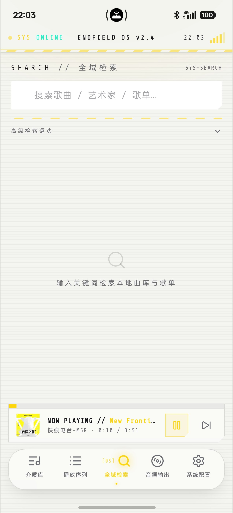
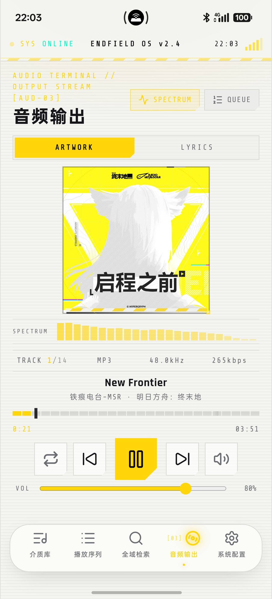
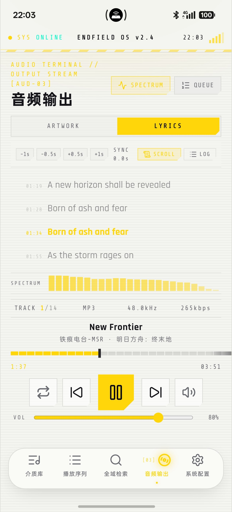
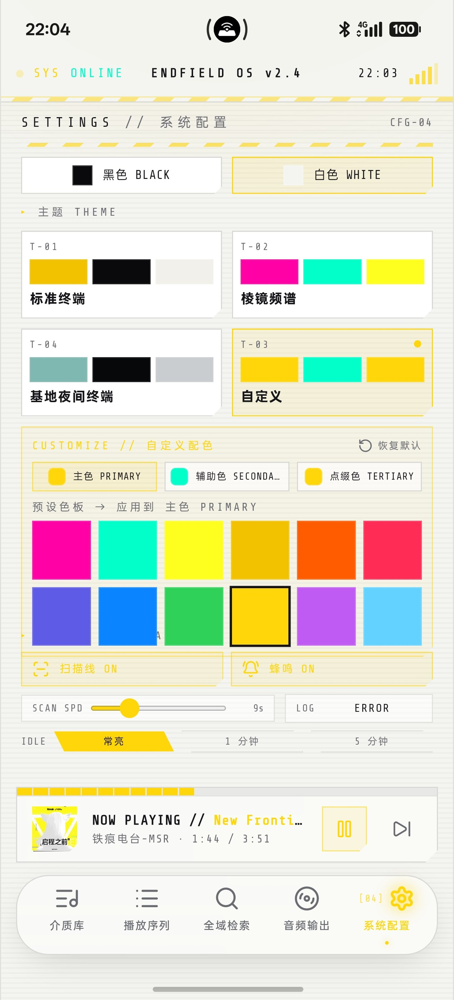

# 终末地音乐终端 · Endfield Music Terminal

一款以《明日方舟：终末地》为视觉灵感、可打包为 Android APK 的**本地音乐播放器**。整体采用黄 / 黑 / 暖白三色，密集使用终末地风格的系统 UI 元素（警戒条纹、角括号面板、切角按钮、六边形徽章、BOOT 日志式启动动画）。


[](https://github.com/TATHPE/endfield-music-terminal/releases)
[](https://github.com/TATHPE/endfield-music-terminal/releases)
[](LICENSE)
[](https://github.com/TATHPE/endfield-music-terminal)
[](https://github.com/TATHPE/endfield-music-terminal)
[](https://github.com/TATHPE/endfield-music-terminal/actions)
[](https://github.com/TATHPE/endfield-music-terminal)

## 功能特性

- **五页终端界面**：介质库 `[01]` / 播放序列 `[02]` / 音频输出 `[03]` / 系统配置 `[04]` / 全域检索 `[05]`——底部毛玻璃 Dock 五个等宽入口，点击或在主体区域左右滑动切换；滑入检索页不会自动弹出键盘。
- **介质库**：页首显示 `TRACKS / TOTAL / READY` 状态与「扫描设备」「+ 导入曲目」入口；**ALL / 战场记录 / 通讯日志 / BGM / 环境音** 分类页签按介质标签筛选；每行显示序号（播放中改为频谱条）、封面、标题、`[标签]`、艺术家 · 专辑与时长，行内可 **编辑介质标签 / 收藏 / 加入播放序列 / 移除**。
- **扫描设备**：调用原生 MediaScanner 直接读取手机媒体库（Android 13+ 请求 `READ_MEDIA_AUDIO`，被拒可一键跳转系统设置），按设备路径自动去重、跳过已入库曲目，结果与失败原因（新增 / 跳过 / 权限被拒）连同 SYSTEM LOG 面板回显在介质库页首。
- **音频解析**：`music-metadata` 解析 ID3 / FLAC / MP4 / OGG / WAV / APE 等标签与内嵌封面，解析失败以文件名兜底；导入的本地文件若无内嵌封面会异步向 iTunes 公共曲库匹配（600×600）；设备扫描曲目的封面在列表 / 播放页按需加载（系统 albumart → 内嵌图 → iTunes 300×300 兜底）。封面匹配不阻塞扫描与播放。
- **同步歌词**：内置 LRC 解析器（时间戳 / offset），逐行高亮并自动滚动居中；歌词页提供 **±0.5s / ±1s 时间轴微调（偏移量持久化）**、**SCROLL 居中滚动**与 **LOG 全量日志**两种阅读模式。扫描只自动读取歌曲同目录的同名 `.lrc` / `.txt`，**联网获取歌词由用户在歌词页主动触发**（网易云 → QQ 音乐双源），也可直接导入本地 `.lrc` / `.txt`。
- **播放序列**：内置「收藏」清单与自定义序列（新建 / 展开 / 删除），序列卡片可整单播放或移除单曲；播放队列面板可查看队列、移出曲目，并用 `SAVE SNAPSHOT` 把当前队列存为快照。
- **全域检索**：按关键词过滤本地介质库（歌曲 / 艺术家 / 专辑），纯关键词查询时同时匹配播放序列；支持**高级检索语法** `artist:` / `album:` / `tag:` / `duration:<秒数>`（可空格组合，AND 生效），命中时面板提示 `ADVANCED QUERY ACTIVE`；结果可直接播放，歌曲可一键收藏。
- **音频输出**：ARTWORK（整幅正方形封面 + SPECTRUM 实时频谱）/ LYRICS 双面板；`TRACK / 格式 / 采样率 / 码率` 四列参数（设备扫描曲目的采样率 / 码率显示为 `--`）、26 段刻度进度条、`VOL` 滑块；播放模式在 **序列循环 → 无序序列 → 单介质循环** 之间切换。
- **后台播放与锁屏控制**：Media Session + Android 前台媒体服务（`mediaPlayback`），通知栏 / 锁屏显示歌曲、封面与进度，支持播放 / 暂停 / 上一曲 / 下一曲 / ±10s / 拖动进度；**ColorOS 17 锁屏拖动进度条回弹已在 v1.4.2 修复**（原生回调 `details` 透传 + 精确读取秒级 `seekTime`）。
- **系统配置**：**黑色 / 白色**纯色外壳切换；主题 **T-01 标准终端**（柠檬黄 / 黑 / 暖白）、**T-02 棱镜频谱**（亮粉 / 青绿 / 明黄）、**T-04 基地夜间终端**（低饱和青 / 深黑 / 灰）与 **T-03 自定义**（主色 / 辅助色 / 点缀色 + 12 预设色板 + 恢复默认）；终端行为开关 **扫描线**（可调转速 4–24s）、**按键蜂鸣**、**LOG 级别**（trace / info / warn / error，过滤 SYSTEM LOG 终端日志输出）、**IDLE 待机**（常亮 / 1 分钟 / 5 分钟，到点进入待机暗屏、点击唤醒）——发布订阅即时生效，无需重启。
- **终末地风格启动动画**：原生启动屏（六边形徽章）接 Web BOOT 流程——徽章脉冲 + 扫描光带 + 6 行 BOOT 日志（BOOT / MEM / AUD / BUS / LINK / NET）+ 24 段进度条，整段约 2.9 秒，任意点击可跳过。
- **终末地风格应用图标**：黑胶唱片式——纯白四角 + 黑色唱片盘面 + 黄色六边形播放键与外圈环形进度条；全密度位图（mdpi 48 – xxxhdpi 192）嵌入 Android Launcher。
- **系统适配（Android 8–16）**：全版本强制 edge-to-edge，状态栏 / 导航栏图标与背景按明暗**双通道**同步（自研 `EndfieldSystemBars` 原生插件为主，官方 `@capacitor/status-bar` 与旧版 `setStatusBarColor` 着色兜底），并关闭 ROM 强制深色；预测性返回手势、横屏刘海 / 挖孔安全区、Dock 固定在手势条之上、通知权限运行时请求；已适配 ColorOS / HyperOS / OriginOS / 鸿蒙 / One UI。
- **离线可用与持久化**：除用户主动发起的歌词 / 封面联网匹配外全程离线；介质库（含音频 Blob）与序列存 IndexedDB，主题、背景、终端行为、歌词偏移、音量与播放模式存 localStorage，重启自动恢复。

## 界面预览

> 截图取自 ColorOS 17 真机实拍（竖屏，v1.4.2 浅色主题），与实际 APK 界面一致：介质库 / 播放序列 / 全域检索 / 音频输出（封面 · 歌词）/ 系统配置。

| | |
| --- | --- |
| **① 介质库** —— AUDIO TERMINAL // MEDIA NODE：TRACKS 14 · TOTAL 49:51 · READY 状态；分类页签 **ALL · 战场记录 · 通讯日志 · BGM · 环境音**；右上角「扫描设备」与「+ 导入曲目」；播放中曲目高亮（序号改频谱条），行内可编辑标签 / 收藏 / 加入序列 / 移除；底部毛玻璃 Dock 常驻。<br><br> | **② 播放序列** —— SEQUENCE NODE 播放队列清单：「新建播放序列名称…」输入框 + 「+」；「收藏」清单（0 TRACKS · 0:00）与播放键；未创建序列时显示空状态引导，页脚提示「介质库中点击 ♥ 可将介质加入收藏清单」。<br><br> |
| **③ 全域检索** —— SEARCH 页：搜索「歌曲 / 艺术家 / 播放序列」输入框（滑入页面不自动弹键盘）；**高级检索语法**折叠面板；未输入时显示空状态「输入关键词检索本地介质库与播放序列」。<br><br> | **④ 音频输出 · 封面** —— OUTPUT STREAM / ARTWORK 面板：专辑封面整幅正方形显示，SPECTRUM 频谱，TRACK 1/14 · MP3 · 48.0kHz · 265kbps 四列参数，分段刻度进度条与时间，循环 / 上一曲 / 暂停 / 下一曲 / 音量（VOL 80%）。<br><br> |
| **⑤ 音频输出 · 歌词** —— LYRICS 面板：歌词同步工具栏（**−1s / −0.5s / +0.5s / +1s**、SYNC 0.0s、SCROLL 滚动、LOG）；LRC 逐行高亮并标注时间轴（01:19 / 01:28 / 01:34 …），浅色背景下清晰可读。<br><br> | **⑥ 系统配置** —— SETTINGS 页：**黑色 / 白色**背景切换；主题 **T-01 标准终端 · T-02 棱镜频谱 · T-03 自定义 · T-04 基地夜间终端**；自定义配色（主色 / 辅助色 / 点缀色）+ 预设色板 + 恢复默认；终端行为开关 **扫描线 ON · 蜂鸣 ON · SCAN SPD 9s · LOG ERROR · IDLE 常亮 / 1 分钟 / 5 分钟**。<br><br> |

## 使用方式

1. **导入曲目**：进入「介质库」`[01]`。
   - **扫描设备**：直接读取手机媒体库批量导入（自动去重、跳过已入库曲目；Android 13+ 首次会请求音频读取权限，被拒可一键跳转系统设置），结果与失败原因回显在页首；
   - **+ 导入曲目**：手动选择本地音频（mp3 / flac / m4a / wav / ogg / aac / opus / ape / wma / aiff，支持多选与拖拽），导入时解析标签、时长、内嵌封面与内嵌歌词，无封面时联网匹配。
2. **分类与标签**：介质库页签 **ALL / 战场记录 / 通讯日志 / BGM / 环境音** 按介质标签筛选；点行内 **标签图标** 可从这 4 个预设标签中勾选或一键清空该曲目的标签。
3. **播放**：点任意一行即开始播放并进入「音频输出」`[03]`；播放中的行序号变为频谱条，MiniPlayer 胶囊常驻 Dock 上方显示进度，点击可回到音频输出页。
4. **音频输出页**：
   - **ARTWORK / LYRICS**：切换封面视图与歌词视图；**SPECTRUM** 开关节奏频谱，**QUEUE** 展开播放队列（可移出曲目、`SAVE SNAPSHOT` 存快照）；
   - **播放模式**：点模式图标在 **序列循环 → 无序序列 → 单介质循环** 之间切换；
   - **进度与音量**：拖动 26 段刻度进度条跳转，`VOL` 滑块调节音量，点喇叭键静音。
5. **歌词**：歌词页顶部工具栏可 **±0.5s / ±1s 微调时间轴**（`SYNC` 显示当前偏移并自动保存），**SCROLL** 为居中滚动阅读、**LOG** 为带时间戳的全量歌词日志；无歌词时点 **REQUEST REMOTE LYRIC** 联网获取（网易云 → QQ 音乐）或 **IMPORT LOCAL SCRIPT** 导入本地 `.lrc` / `.txt`。
6. **收藏与播放序列**：介质库行内点 **♥** 加入收藏、点 **加入序列** 图标选择或即时新建序列；「播放序列」`[02]` 页可新建 / 展开 / 删除序列并整单播放，页脚提示「介质库中点击 ♥ 可将介质加入收藏清单」。
7. **全域检索**：点 Dock 的「全域检索」`[05]`，输入关键词过滤介质库（歌曲 / 艺术家 / 专辑；纯关键词查询时也匹配序列）；展开 **高级检索语法** 可用 `artist:xxx`、`album:xxx`、`tag:战场记录`、`duration:<120` 组合筛选，结果可直接播放、歌曲可一键收藏。
8. **系统配置**：`[04]` 页切换 **黑色 / 白色** 外壳、选择主题 **T-01 / T-02 / T-04 / T-03 自定义**（自定义可调配主色 / 辅助色 / 点缀色并保存），并调整终端行为：**扫描线**（开关 + 转速）、**蜂鸣**、**LOG 级别**、**IDLE 待机时间**——全部即时生效并持久化。
9. **滑动切换**：在主体区域**左右滑动**即可在五个页面间切换（底部 Dock 点击同样可用）。
10. **后台与锁屏**：退到后台或锁屏后，通知栏与锁屏显示歌曲、封面与进度，可播放 / 暂停 / 上一曲 / 下一曲 / ±10s / 拖动进度；首次安装 Android 13+ 会请求通知权限。
11. **重启恢复**：介质库、序列、播放模式、音量、主题、背景与终端行为偏好全部持久化，重新打开应用即恢复上次状态。

## 下载

| 版本 | 说明 | 下载 |
| --- | --- | --- |
| v1.4.2 (release · 正式版) | 正式签名版，**锁屏拖动进度条回弹修复 + 频谱 / 终端行为开关 / 布局 / 歌词同步 / 多 ROM 适配修复**（详见下方 v1.4.2 更新内容）；不含预置歌曲（通过扫描设备从手机导入） | [EndfieldMusicTerminal-v1.4.2.apk](https://github.com/TATHPE/endfield-music-terminal/releases/download/v1.4.2/EndfieldMusicTerminal-v1.4.2.apk) |
| v1.4.1 (release · 正式版) | 正式签名版，**歌词获取流程重构**：扫描歌曲仅读取本地同名 .lrc/.txt、**不自动联网匹配**；无歌词歌曲在歌词页自主选择「联网获取歌词」或「导入歌词文件」；封面在线匹配改为后台线程池异步执行；修复曲库副标题 ORIGIN NODE — 本地音频存储 在安卓上的错误断行；不含预置歌曲（通过扫描设备从手机导入） | [EndfieldMusicTerminal-v1.4.1.apk](https://github.com/TATHPE/endfield-music-terminal/releases/download/v1.4.1/EndfieldMusicTerminal-v1.4.1.apk) |
| v1.4.0 (release · 已移除) | 正式签名版（**已移除**）：设备音乐自动化——「扫描设备」导入手机音乐（自动去重）、歌词自动匹配（本地 LRC 优先 → 网易云 / QQ 音乐双源联网匹配）、无内嵌封面自动匹配专辑封面（iTunes 公共曲库）。因**播放体验不佳**（ColorOS 17 锁屏进度条回弹、联网匹配期间播放排队等待）已移除安装包，**建议使用 v1.4.1** | 已移除（无下载） |
| v1.3.9 (release · 完整版) | 正式签名版，**内置 14 首《明日方舟：终末地》预置曲库**（含封面与 LRC 歌词，打开曲库即可播放）；**应用图标重绘为黑胶唱片式**（纯白四角 + 黑色盘面 + 黄色六边形播放键与环形进度条，黄/黑/白三色统一），全密度位图嵌入 Launcher（48–192px） | [EndfieldMusicTerminal-v1.3.9.apk](https://github.com/TATHPE/endfield-music-terminal/releases/download/v1.0.0/EndfieldMusicTerminal-v1.3.9.apk) |
| v1.3.9 (release · 无歌曲版) | 正式签名版，**不含预置曲库**（约 4 MB 轻量包），仅保留导入与全部功能 | [EndfieldMusicTerminal-v1.3.9-lite.apk](https://github.com/TATHPE/endfield-music-terminal/releases/download/v1.0.0/EndfieldMusicTerminal-v1.3.9-lite.apk) |
| v1.3.9 (debug) | 调试签名版（完整版），仅用于体验 | [EndfieldMusicTerminal-v1.3.9-debug.apk](https://github.com/TATHPE/endfield-music-terminal/releases/download/v1.0.0/EndfieldMusicTerminal-v1.3.9-debug.apk) |
| v1.3.8 (release · 完整版) | 正式签名版，**内置 14 首《明日方舟：终末地》预置曲库**（含封面与 LRC 歌词，打开曲库即可播放）；**全版本强制 edge-to-edge 根治浅色状态栏黑条**（状态栏/导航栏区域改由应用内容直接绘制，明暗完全跟随主题，任何 ROM 都无法再覆盖成黑条）；修复原生兜底时序（页面加载完成才读背景模式，避免误判）+ 布局单位兼容（旧内核下 Dock 位置正确） | [EndfieldMusicTerminal-v1.3.8.apk](https://github.com/TATHPE/endfield-music-terminal/releases/download/v1.0.0/EndfieldMusicTerminal-v1.3.8.apk) |
| v1.3.8 (release · 无歌曲版) | 正式签名版，**不含预置曲库**（约 4 MB 轻量包），仅保留导入与全部功能 | [EndfieldMusicTerminal-v1.3.8-lite.apk](https://github.com/TATHPE/endfield-music-terminal/releases/download/v1.0.0/EndfieldMusicTerminal-v1.3.8-lite.apk) |
| v1.3.8 (debug) | 调试签名版（完整版），仅用于体验 | [EndfieldMusicTerminal-v1.3.8-debug.apk](https://github.com/TATHPE/endfield-music-terminal/releases/download/v1.0.0/EndfieldMusicTerminal-v1.3.8-debug.apk) |

> **v1.4.2 更新内容（界面与功能更新 · 锁屏拖动进度条回弹修复 · 多 ROM 适配）**：**界面更新**——底部 Dock 五页统一为 介质库 `[01]` / 播放序列 `[02]` / 音频输出 `[03]` / 系统配置 `[04]` / 全域检索 `[05]`（五项等宽，激活项显示编号与状态圆点）；介质库新增 `TRACKS / TOTAL / READY` 状态行与 **ALL / 战场记录 / 通讯日志 / BGM / 环境音** 分类页签，行内为标签 / 收藏 / 加入序列 / 移除四键；全域检索新增 **高级检索语法** 面板（命中时显示 `ADVANCED QUERY ACTIVE`）；音频输出为 ARTWORK / LYRICS 双面板 + `SPECTRUM` 频谱与 `TRACK / 格式 / 采样率 / 码率` 四列读数、26 段刻度进度条；系统配置为黑 / 白外壳 + 四张主题卡（**T-01 标准终端 · T-02 棱镜频谱 · T-03 自定义 · T-04 基地夜间终端**）+ 自定义配色（主色 / 辅助色 / 点缀色 + 12 预设色板 + 恢复默认）+ 终端行为分组。系统配置页改为**可上下滚动**、**自定义配色面板常驻**，底部终端行为控件不再被悬浮 MiniPlayer / Dock 遮挡（v1.4.2 后续构建）。**功能更新**——介质标签（4 个预设标签，逐曲指定 / 清空，`[标签]` 显示在副标题）；高级检索语法 `artist:` / `album:` / `tag:` / `duration:<秒数>`（空格组合 AND）；歌词工具栏 **±0.5s / ±1s 时间轴微调（偏移持久化）** + **SCROLL 居中滚动** + **LOG 全量日志**，无歌词时可联网获取（网易云 → QQ 音乐）或导入 `.lrc`；队列 `SAVE SNAPSHOT` 快照存档；终端行为开关 **扫描线（4–24s 转速）/ 按键蜂鸣 / LOG 级别（现已真实过滤 SYSTEM LOG 输出）/ IDLE 待机（常亮 · 1 · 5 分钟）**；启动流程为原生启动屏 + BOOT 动画（约 2.9 秒，可点击跳过）。**文案统一**——界面文案统一为 介质库 / 播放序列 / 全域检索 / 音频输出 / 系统配置（加入弹窗由「加入歌单」改为「加入播放序列」，检索占位与空状态同步调整），扫描完成提示改为「本地歌词已读取」（原「歌词自动匹配中」与扫描仅读取本地歌词的实际行为不符）。**核心修复：锁屏拖动进度条回弹**现已完全适配 ColorOS 17——根因在 JS 侧 `MediaSessionBridge`：插件回调包装器把原生回传的 `details`（含目标位置 `seekTime`）整包丢弃，导致锁屏 seek 取不到目标位置而回弹；已改为透传回调参数并精确读取秒级 `seekTime`，类型检查通过。**其余修复**：频谱空白（根容器宽度为 0 不可见，改为 `flex-1 min-w-0`；并修复 AudioContext 不 resume、隐藏媒体返回零数据、无重试等链路问题）；终端行为开关不实时生效（改为发布订阅 + `useSyncExternalStore`）；MiniPlayer 遮挡设置项、「17s LOG」截断、标题与 SYS ONLINE 重叠（逐项修正布局与居中）；歌词不同步（滚动由 smooth 改为瞬时精确吸附，消除密集段落的追赶滞后）；**HyperOS / OriginOS**：系统栏双通道刷新 + legacy 兜底，Dock 安全区，播放键改静态图标避免旧内核卡 opacity。
> **v1.4.1 更新内容（歌词获取流程重构）**：设备扫描歌曲后仅读取本地同名 .lrc / .txt 歌词，**不再自动联网匹配**——无歌词歌曲在歌词页显示「这首歌没有歌词」引导界面，由用户自主选择「联网获取歌词」（网易云 / QQ 音乐双源）或「导入歌词文件」（本地 .lrc）；封面在线匹配（iTunes 公共曲库）改为后台线程池异步执行，扫描与播放不再被网络 I/O 阻塞；修复曲库副标题 `ORIGIN NODE — 本地音频存储` 在安卓上的错误断行（词组级换行，不再从词中断开）。**终末地歌曲资产**：正式版不含预置歌曲，《明日方舟：终末地》官方 Vocal 曲目（14 首，含专辑封面与 LRC 歌词）可下载歌曲资产包 **EndfieldSongs-v1.0.zip**（位于 v1.0.0 Release 资产，约 92 MB）：https://github.com/TATHPE/endfield-music-terminal/releases/download/v1.0.0/EndfieldSongs-v1.0.zip —— 解压后通过「+ 导入曲目」批量导入即可（该资产包**不在 MIT 授权范围内**，仅供个人本地试听）。
> **v1.4.0 更新内容（设备音乐自动化 · 正式版 · 已移除）**：新增「扫描设备」一键导入手机音乐（自动去重）；自动匹配歌词（优先读取歌曲同目录 .lrc/.txt，无本地歌词时联网匹配——网易云 → QQ 音乐双源，写入曲库）；无内嵌封面自动匹配专辑封面（Apple iTunes 公共曲库，歌名 + 歌手匹配，300×300 大图）；设备歌曲播放重构为原生读取 + Blob 播放（根治 ColorOS 17 上 WebView 音频不可拖动、播放无声）；锁屏进度条防回弹机制（对系统媒体控件时间回灌生效）；权限被拒时弹窗一键跳转系统权限页。⚠️ **重要说明：自动匹配歌词时音乐无法播放属正常现象**——扫描导入大量歌曲后，播放器为每首歌逐首发起歌词、封面的联网匹配请求，这些请求是同步网络 I/O（单首最长约 15 秒超时），运行于原生主线程，请求期间音频播放指令会短暂排队等待，表现为「点击播放后没有立即出声」；匹配任务完成后播放立即恢复正常，建议扫描后稍等片刻再播放。⚠️ **已知遗留问题**：ColorOS 17 锁屏界面拖动进度条仍会回弹、无法随进度条快进（Media Session 媒体会话对 seek 指令的兼容限制），后续版本继续跟进。**本版本因播放体验不佳已移除安装包**，不再提供下载，建议直接使用 v1.4.1（歌词获取流程重构：扫描不自动联网 / 歌词页自主获取或导入 / 封面异步匹配）。
> **v1.3.9 更新内容（应用图标重绘 · 黑胶唱片式）**：将应用图标整体重绘为黑胶唱片式视觉——纯白四角背景（干净无装饰）+ 黑色唱片盘面 + 中央黄色六边形播放键与外圈黄色环形进度条（黄/黑/白三色与界面风格统一）；同时将图标由原自适应矢量改为**全密度位图嵌入**（mdpi 48 至 xxxhdpi 192，圆角方形 Launcher 图标），各机型显示一致、无系统遮罩偏差。功能与适配保持 v1.3.8 全部能力（全版本 edge-to-edge、ColorOS 17 / OriginOS 3 / HyperOS 等主流系统适配、14 首预置曲库、LRC 歌词、三主题自定义、锁屏控制）。
> **v1.3.8 更新内容（浅色状态栏黑条 · 全版本 edge-to-edge 根治）**：前两版（v1.3.6 仅加触发次数、v1.3.7 插件改名 + 原生兜底）在 OriginOS 3 真机上仍未生效——排查发现其根因不只是插件时序：非强制 edge-to-edge 的 Android（OriginOS 3 / Android 13 等）上，状态栏颜色由系统 `statusBarColor` 决定，任何着色调用都可能被 ROM 拦截或时序错过。v1.3.8 改为**所有 Android 版本强制 edge-to-edge**（`setDecorFitsSystemWindows(false)`），状态栏 / 导航栏区域直接由应用内容绘制，明暗背景**纯 CSS 跟随主题**——浅色模式必为浅色、深色模式必为深色，不再依赖任何原生着色调用；同时修复原生兜底在页面加载完成前误读背景模式的时序问题（`readyState` 门控 + 24 次重试），并将布局单位从 `dvh` 换成兼容写法（修复部分旧内核 Dock 位置异常）。
> ColorOS 17 侧载时若提示「未知来源」，在设置中允许安装即可。

## 技术栈


| 层 | 技术 |
| --- | --- |
| Web 前端 | React 19 + TypeScript 5.9 + Tailwind CSS v4 |
| 播放引擎 | HTML5 Audio + Web Audio API（频谱动画） |
| 标签解析 | music-metadata 12（浏览器构建） |
| 歌词与封面匹配 | 本地 `.lrc` / `.txt` → 网易云 / QQ 音乐；封面 iTunes 公共曲库 / 系统专辑图 |
| 数据存储 | IndexedDB（曲库 / 序列） + localStorage（主题 / 背景 / 终端行为 / 歌词偏移） |
| 移动端封装 | Capacitor 8（Android 平台，含自研 MediaScanner / SystemBars 插件） |
| 构建 | Vite 8（Web）+ Gradle 8.14 / AGP 8.13（APK；minSdk 24 / targetSdk 36） |

## 目录结构

```
endfield-player/
├── src/                     # Web 源码
│   ├── pages/HomePage/      # 主壳（五页切换 / 手势滑动 / Dock / MiniPlayer）
│   ├── components/player/   # 播放器界面（LibraryView / PlaylistsView / SearchView /
│   │                        #   NowPlayingView / LyricsView / SettingsView / SplashScreen / BottomNav ...）
│   └── lib/                 # 数据与能力层（db / parser / music / lyrics / playlists /
│                            #   player-context / media-scanner / terminal-config / theme）
├── android/                 # Capacitor Android 原生工程（MediaScannerPlugin / SystemBarsPlugin、自绘启动页与图标）
├── public/                  # 静态资源（图标、预置曲库 manifest）
├── docs/                    # 界面截图与功能说明
├── tools/                   # 本机构建脚本 build-apk.ps1 与歌曲索引生成器 gen-song-manifest.mjs
├── capacitor.config.ts      # Capacitor 配置（appId: com.endfield.audio.terminal）
├── vite.config.ts           # Web 构建配置
└── vite.capacitor.config.ts # APK 专用构建配置（输出 dist/apk）
```

## 本地运行（Web）

```bash
npm install
npm run dev
```

## 构建 Android APK

需要 JDK 17+（推荐 21）、Android SDK（platform 36 / build-tools 36）、Gradle 8.14+。

```bash
# 1. 构建 Web 产物（专用配置，产出 dist/apk）
npx vite build --config vite.capacitor.config.ts

# 2. 同步到 Android 工程
npx cap sync android

# 3. 构建 debug APK（产物在 android/app/build/outputs/apk/debug/）
cd android
gradle assembleDebug
```

### 在线流媒体（在线地址）

播放器支持播放**你自己提供的** `http/https` 音频流（mp3 / flac / m4a / ogg / opus / wav…）：
介质库点「在线地址（流媒体）」→ 粘贴合法公开的音频直链 → 添加。地址保存在本机介质库里，随介质库一起管理（可删除）。

- **本程序只做「播放流」，不做「获取资源」**：不内置任何音乐平台源，不提供搜索、下载、解密、去水印或代理解析接口，也不会改写请求绕过任何平台的限制
- 请自行确保所填地址来源合法、且你有权访问与播放；因来源不当产生的后果由使用者自负
- 不支持 `m3u8` / `mpd` 播放列表（HLS / DASH）：安卓 WebView 的 `<audio>` 没有原生 HLS 支持，已在输入时直接拦下并给出提示
- 需要登录 Cookie、防盗链签名，或未开放 CORS 的地址通常无法播放（界面会提示「音频加载失败」）
- **到哪里找可以直接粘贴的地址**（本程序不代你检索、也不内置任何源）：
  - **Internet Archive**（archive.org）：打开一个条目页 → 右侧「DOWNLOAD OPTIONS」→ 对某个 `.mp3` 右键「复制链接」；直链形如
    `https://archive.org/download/<条目ID>/<文件名>.mp3`
  - **LibriVox**（librivox.org）：有声书条目页提供分章 mp3（托管在 archive.org 上），同样右键复制链接即可
  - **维基共享资源**（commons.wikimedia.org）：公共领域/自由许可的音频文件页有「原始文件」直链，形如
    `https://upload.wikimedia.org/wikipedia/commons/...`
  - 以上都是**公共领域或自由许可**资源；具体条目是否可播放取决于该站点当时是否可达、是否允许跨域访问
- 说明：README 里不列具体曲目直链——链接会失效、也可能被误当成「内置资源」；请按上面的方式自行复制你信任的地址

### 一键构建脚本（本机）

```powershell
pwsh tools/build-apk.ps1                  # 完整版（要求 public/songs 内有歌曲资产）
pwsh tools/build-apk.ps1 -NoSongs         # 无歌曲版（R8 压缩后约 2 MB，无预置曲库）
pwsh tools/build-apk.ps1 -Type both -OutDir D:\out
```

- 版本号取自 `package.json` 的 `version`，`versionCode` 自动推导为 `主 × 10000 + 次 × 100 + 修`（`1.4.3` → `10403`），也可用 `-PappVersionName=` / `-PappVersionCode=` 覆盖
- 预置曲库索引 `public/songs/manifest.json` **不入库**，由 `node tools/gen-song-manifest.mjs` 从本地歌曲资产生成（歌曲资产见 Release 资产包 `EndfieldSongs-v1.0.zip`）
- `-NoSongs` 会先把 `public/songs` 临时移开再构建，因此产出的包不含预置曲库与索引

### GitHub Actions 自动构建

每次 push 到 `main` 会先做类型检查与 ESLint 检查，再自动构建 debug APK，产物上传为 Actions Artifact（仓库 Actions 页面可下载最新版）。

如需自动构建**正式签名版**，在仓库 Settings → Secrets and variables → Actions 新增：

| Secret | 值 |
| --- | --- |
| `KEYSTORE_BASE64` | 密钥库文件 base64 编码（`base64 -w0 release.keystore` 或 `certutil -encode` 输出） |
| `KEYSTORE_PASSWORD` | 密钥库密码（storePassword = keyPassword） |
| `KEYSTORE_ALIAS` | 密钥别名（本项目为 `endfield`） |

配置后，每次 push 的 `release` job 会自动用该密钥构建并上传正式签名 APK。

### 打标签自动发版

推送形如 `v1.4.3` 的标签（或在 Actions 页面手动运行 `Release` 工作流并填标签）会依次执行：类型检查与 ESLint → 用 secrets 还原签名密钥 → 构建签名 APK（版本号取自标签）→ 创建或更新对应 Release，并上传 `EndfieldMusicTerminal-v1.4.3.apk`。

## 应用信息

- 应用名：终末地音乐终端
- 包名 / applicationId：`com.endfield.audio.terminal`
- minSdk 24 / targetSdk 36
- Android 版本：v1.4.2（`versionCode` 由 `package.json` 的版本推导：`1.4.2` → `10402`；锁屏拖动进度条 seek 修复 / 频谱渲染链路修复 / 终端行为开关实时生效 / 歌词瞬时精确吸附 / HyperOS·OriginOS 系统栏双通道适配）；历史版本 v1.4.1 / v1.4.0 / v1.3.9 / v1.3.8 保留在对应 Release 可下载

## 权限与隐私

| 权限 | 用途 |
| --- | --- |
| `READ_MEDIA_AUDIO`（Android 13+）/ `READ_EXTERNAL_STORAGE`（≤ Android 12） | 「扫描设备」读取手机中的音频文件，只读取音频 |
| `POST_NOTIFICATIONS` | 通知栏媒体控制（Android 13+ 首次安装时请求） |
| `FOREGROUND_SERVICE` / `FOREGROUND_SERVICE_MEDIA_PLAYBACK` / `WAKE_LOCK` | 后台播放与锁屏媒体控制 |
| `INTERNET` | 仅在用户主动发起时使用：联网获取歌词（网易云 → QQ 音乐）、封面匹配（iTunes） |

- 曲库、播放序列、主题与偏好全部**保存在本机**（IndexedDB / localStorage），不上传任何服务器
- 应用**不包含**统计、广告或崩溃上报 SDK
- 为避免媒体库被同步到云端或被迁移到其它设备，应用已关闭系统备份与设备间迁移

## License

本项目**源代码**以 [MIT License](LICENSE) 开源，可自由使用、修改与分发（含商用），须保留版权声明。

> ⚠️ **MIT 只覆盖代码**：Release 里的歌曲资产包 **EndfieldSongs-v1.0.zip** 不在本项目授权范围内——其中的音乐、歌词与封面版权归原权利人（鹰角网络 / 塞壬唱片等）所有，仅供个人学习与本地试听，请勿二次分发或商用。

## 免责声明

本项目为粉丝向学习项目，与《明日方舟：终末地》及其开发商无关。**代码仓库本身不包含任何游戏素材**；可选的歌曲资产包由用户自行下载并导入本地，其中音乐 / 歌词 / 封面版权归原权利人所有，不在 MIT 授权范围内（见上一节）。

本项目由 **AI 辅助开发**，辅助开发所使用的 AI 包括 **豆包** 与 **DeepSeek**。如果你对本项目有新的想法，欢迎直接把源码交给豆包或 DeepSeek 修改。
